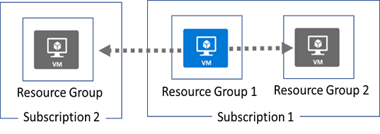

**Azure Resource Manager locks**
--------------------------------

*   You can associate the lock with a subscription, resource group, or resource.

*   There are two types of resource locks.

*   **Read-Only locks**, which prevent any changes to the resource.
    
*   **Delete locks**, which prevent deletion.

**Terminology**

*   Azure Cloud Shell is a browser-accessible command-line experience for managing Azure resources, provides the flexibility of choosing the shell experience that best suits the way you work, allowing you to work either in Bash or PowerShell, right from the browser..

*   Azure CLI - Azure Command-Line Interface (CLI) is a set of commands you can use to manage your Azure resources from your terminal or command prompt

**Azure Resource Manager (ARM) template**
------------------------------------------

**Purpose:**

*   ARM templates are JSON files that define the infrastructure and configuration of your Azure resources.
    
*   They enable infrastructure as code (IaC), allowing you to automate resource deployment and configuration in a repeatable and consistent way.
    

**Benefits:**

*   **Repeatability and Consistency:** Ensure deployments are identical across environments, reducing errors and inconsistencies.
    
*   **Version Control:** Treat templates like code, allowing version control and tracking changes.
    
*   **Scalability:** Easily deploy complex infrastructure with multiple resources through a single template.
    
*   **Automation:** Automate infrastructure provisioning and configuration for faster deployments.
    

**Structure:**

*   Written in JSON format, with a specific syntax for defining resources, properties, and dependencies.
    
*   Key sections include:
    
    *   $schema: Reference to the ARM template schema version.
        
    *   resources: Definition of individual Azure resources to be deployed (e.g., virtual machines, storage accounts, databases).
        
    *   parameters: Define values you can specify during deployment for customization (e.g., VM size, storage account name).
        
    *   variables: Define reusable values within the template to improve readability and maintainability.
        
    *   outputs: Define values returned after deployment, useful for referencing in other resources or scripts.
        

**Deployment:**

*   ARM templates can be deployed through various methods, including:
    
    *   Azure Portal
        
    *   Azure CLI
        
    *   Azure PowerShell
        
    *   DevOps tools like Azure Pipelines

**Deploy a resource group by template**
*   An example to deploy a new storage via deployment template. 

`   az deployment group create --name "addfunction" --template-file azurestoragedeploy.json --parameters azurestoragedeploy.parameters.json`

*   To delete deployment template. Note that the including resources in template are not deleted when deleting the deployment.

`   az deployment group delete --name "addfunction"`

Reference: https://learn.microsoft.com/en-US/cli/azure/deployment/group?view=azure-cli-latest#az-deployment-group-create

