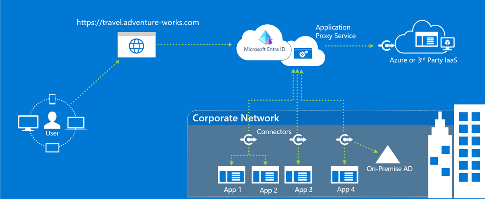

**Key differences between Microsoft Entra and Active Directory Domain Services (AD DS) for managing user identities and devices.**
----------------------------------------------------------------------------------------------

*   **Schema:** Microsoft Entra has a simpler schema with fewer object types compared to AD DS. Notably, it lacks the "computer" class but includes "device." Joining devices to Entra differs significantly from joining computers to AD DS.
    
*   **Management:** Entra focuses on "modern management" without traditional domain membership or Group Policy Objects (GPOs) used in AD DS. Its strengths are directory services, data storage, and user/device/application authentication and authorization.
    
*   **Organization:** Entra doesn't support the hierarchical structure of OUs (organizational units) used in AD DS. However, similar organization can be achieved through group memberships.
    
*   **Applications:** Applications are represented by two classes: "Application" defines the application itself, and "servicePrincipal" is its instance within a specific Entra tenant. This allows defining an app once and using it in multiple tenants.
    

Key Points about Microsoft Entra ID vs Active Directory (AD DS)
---------------------------------------------------------------

**What is Active Directory (AD DS)?**

*   Traditional directory service for on-premises networks.
    
*   Stores user accounts, passwords, and other directory data, it's hierarchical, uses local protocols (LDAP, Kerberos),
    
*   Runs on Windows Server domain controllers, manages computer objects within domains (OUs and GPOs).
    

**What is Microsoft Entra ID?**

*   Cloud-based directory service (PaaS) offered by Microsoft.
    
*   Provides identity and access management for cloud resources, it focuses on internet applications (HTTP/HTTPS), is multi-tenant (shared with others)    
*   Offers features not available in AD DS like multi-factor authentication and self-service password reset. Uses a flat structure (no OUs/GPOs), and relies on REST API and protocols like SAML/OAuth for authentication and authorization.
    

**Key Differences:**

*   **Deployment:** Entra ID is cloud-based, AD DS is on-premises.
    
*   **Management:** Entra ID focuses on modern management for web apps, AD DS for on-premises apps.
    
*   **Features:** Entra ID offers additional security features compared to AD DS.
    
*   **Cost:** Entra ID has a free tier, paid tiers offer advanced features.

*   **Focus:** AD DS - Traditional directory service, Entra ID - Modern identity solution

*   **Structure:** AD DS - Hierarchical with OUs, Entra ID - Flat structure with groups

*   **Communication:** AD DS - LDAP, Kerberos, Entra ID - REST API, HTTP/HTTPS protocols

*   **Authentication:** AD DS - Kerberos, Entra ID - SAML/OAuth for authorization, OpenID Connect or authentication.
    

**Microsoft Entra Tenants:**

*   Multi-tenant by design, isolates individual directory instances.
    
*   Associated with Azure subscriptions for permission management.
    
*   Can have custom domain names.
    

**Microsoft Entra Schema:**

*   Simpler structure compared to AD DS.
    
*   Lacks traditional computer object management but offers device management.
    
*   Doesn't support hierarchical organization units (OUs) like AD DS.
    
*   Uses group memberships for similar organization.
    

**Overall:**

*   Entra ID is a modern cloud-based solution for identity and access management of cloud resources.
    
*   Offers a simpler and more secure approach compared to traditional on-premises AD DS.

**Microsoft Entra ID P1 and P2:**

*   Paid subscription tiers offering additional features beyond Free and Office 365 plans.
    
*   Available as standalone licenses or bundled within Microsoft Enterprise Mobility + Security.
    
*   Free trial available for experiencing P2 functionalities.
    

**Key Features of P1:**

*   **Self-service group management:** Users can create, manage, and request to join groups, simplifying administration.
    
*   **Advanced security reports and alerts:** Monitor access with detailed logs, machine learning insights, and improved threat detection.
    
*   **Full multi-factor authentication (MFA):** Enhances security for cloud applications (Azure, M365, Dynamics 365) and third-party apps.
    
*   **Microsoft Identity Manager (MIM) licensing:** Enables hybrid identity solutions by integrating on-premises authentication with Entra ID.
    
*   **Enterprise SLA of 99.9%:** Guarantees high service availability.
    
*   **Password reset with writeback:** Allows self-service password reset adhering to on-premises policies.
    
*   **Cloud App Discovery:** Identifies frequently used cloud applications for better management.
    
*   **Conditional Access:** Configures access restrictions based on device, group, or location for critical resources.
    
*   **Microsoft Entra Connect Health:** Provides operational insights into Entra ID through alerts, performance data, and usage patterns.
    

**Additional Features in P2:**

*   **Microsoft Entra ID Protection:** Offers advanced user account monitoring and protection with risk-based policies and user behavior analysis.
    
*   **Microsoft Entra Privileged Identity Management:** Enhances security for privileged users by defining permanent/temporary admins and access control workflows.

**Migrate Active Directory Domain Service to Microsoft Entra ID?**
------------------------------------------------------------------

*   While Microsoft Entra ID offers a cloud-based alternative to on-premises AD DS, directly migrating Kerberos authentication from AD DS to Entra ID isn't a straightforward process. Here's why:

*   **Different Authentication Protocols:** AD DS primarily uses Kerberos for authentication, while Entra ID focuses on protocols like SAML, OAuth, and OpenID Connect for cloud applications.
    

However, there are strategies to achieve a similar outcome for user access management when migrating from AD DS to a cloud environment with Entra ID:

1.  **Hybrid Identity with Azure Active Directory (Azure AD):**
    
    *   Implement Azure AD Connect to synchronize user identities and groups from your on-premises AD DS to Azure AD.
        
    *   Configure Entra ID to trust Azure AD for user authentication.
        
    *   Applications requiring Kerberos authentication on-premises can continue to utilize AD DS, while cloud applications can leverage Entra ID with Azure AD for access control.
        
2.  **Password Hash Synchronization (PHS):**
    
    *   This approach allows users to sign in to Entra ID with the same username and password they use for AD DS.
        
    *   However, authentication still occurs within Azure AD, not directly using Kerberos from Entra ID.
        
    *   This method requires careful planning and configuration to ensure security best practices.
        
3.  **Application Proxy for On-premises Applications:**
    
    *   If you have applications that rely on Kerberos on-premises, you can leverage Azure AD Application Proxy.
        
    *   This service translates Kerberos tokens issued by Azure AD to NTLM tokens for on-premises applications, enabling access without modifying the applications themselves.
        

**Important Considerations:**

*   Carefully evaluate your application landscape to understand which ones rely on Kerberos authentication.
    
*   Plan and test your migration strategy thoroughly to minimize disruption to users.
    
*   Consider security implications when implementing password hash synchronization.
    

**Additional Resources:**

*   Microsoft documentation on Azure AD Connect: [https://learn.microsoft.com/en-us/microsoft-365/enterprise/set-up-directory-synchronization?view=o365-worldwide](https://learn.microsoft.com/en-us/microsoft-365/enterprise/set-up-directory-synchronization?view=o365-worldwide)
    
*   Microsoft documentation on Azure AD Application Proxy: [https://learn.microsoft.com/en-us/entra/identity/app-proxy/application-proxy-add-on-premises-application](https://learn.microsoft.com/en-us/entra/identity/app-proxy/application-proxy-add-on-premises-application)

**To implement Azure AD Application Proxy:**
----------------------------------------

**What is Azure AD Application Proxy?**

*   A service that enables secure access to on-premises web applications published through Azure AD.
    
*   Ideal for applications that can't be directly migrated to the cloud or don't support modern authentication protocols.
    

**Benefits:**

*   Provides secure access to on-premises applications from anywhere with an internet connection.
    
*   Eliminates the need for VPN connections for users accessing internal apps.
    
*   Simplifies application access management through Azure AD.
    

**Implementation Steps:**

1.  **Download and Install Connector:**
    
    *   Download the connector software on a server within your on-premises network.
        
    *   Install and configure the connector to communicate with the Azure AD service.
        
2.  **Configure Application Proxy in Azure Portal:**
    
    *   Access the Azure portal and navigate to the Azure AD section.
        
    *   Select "Application Proxy" and click "Add an application."
        
    *   Provide the internal URL of the on-premises web application you want to publish.
        
    *   Configure settings like pre-authentication method and access controls.
        
3.  **Assign Users and Groups:**
    
    *   Define which users or groups within Azure AD can access the published application.
        
4.  **Access the Application:**
    
    *   Users can access the published application through a unique external URL provided by Azure AD.
        
    *   Authentication occurs through Azure AD, eliminating the need for VPNs.
        

**Important Notes:**

*   The connector acts as a bridge between Azure AD and your on-premises environment.
    
*   Ensure proper firewall rules allow communication between the connector and Azure AD.
    
*   Consider security best practices like multi-factor authentication (MFA) for added protection.
    

**Additional Resources:**

*   Microsoft documentation on Azure AD Application Proxy: [https://learn.microsoft.com/en-us/entra/identity/](https://learn.microsoft.com/en-us/entra/identity/)