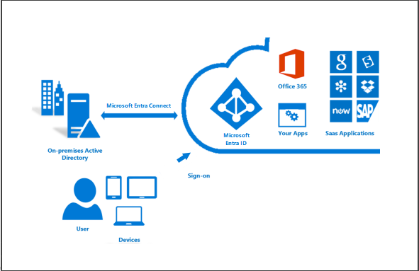
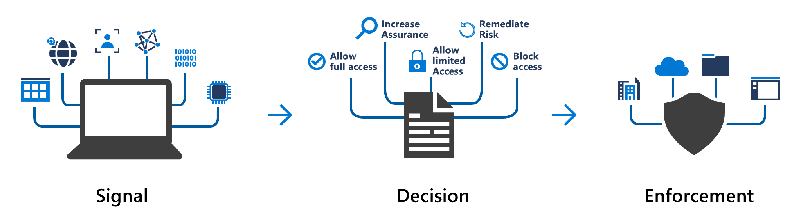
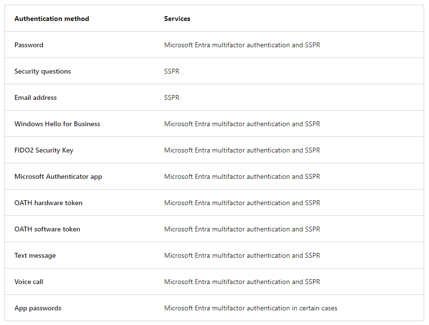

**Differences between the **Security Administrator**, **User Administrator**, and **Global Administrator** roles in Microsoft Entra ID:**
-----------------------------------------------------------------------------------------------------------------------

1.  **Global Administrator**:
    
    *   **Role Description**: Global Administrators have almost unlimited access to your organization’s settings and most of its data.
        
    *   **Permissions**:
        
        *   Full control over all services and settings within Microsoft Entra, including Azure and other Microsoft services.
            
        *   Manage users, reset passwords, configure licenses, and handle domain names.
            
    *   **Recommendation**: Limit the number of Global Admins to enhance security.
        
    *   [**Example**: A Global Admin can configure security policies, manage user accounts, and access all resources](https://learn.microsoft.com/en-us/microsoft-365/admin/add-users/about-admin-roles?view=o365-worldwide) [1] (https://learn.microsoft.com/en-us/microsoft-365/admin/add-users/about-admin-roles?view=o365-worldwide) [2] (https://techcommunity.microsoft.com/t5/itops-talk-blog/what-s-the-difference-between-azure-roles-and-azure-ad-roles/ba-p/2363647).
        
2.  **Security Administrator**:
    
    *   **Role Description**: Security Administrators focus on security and compliance tasks.
        
    *   **Permissions**:
        
        *   Configure security settings, manage authentication methods, and set up policies.
            
        *   Access across multiple security services within Microsoft Entra.
            
    *   **Recommendation**: Assign the least permissive role based on specific tasks.
        
    *   [**Example**: A Security Admin can manage authentication policies, monitor attribute-related events, and customize sign-in experiences](https://answers.microsoft.com/en-us/windows/forum/all/when-to-use-admin-vs-user-accounts/0f21b4d5-3754-45b1-b7b0-eba5e85a4bb8) [3] (https://answers.microsoft.com/en-us/windows/forum/all/when-to-use-admin-vs-user-accounts/0f21b4d5-3754-45b1-b7b0-eba5e85a4bb8).
        
3.  **User Administrator**:
    
    *   **Role Description**: User Administrators handle user-related tasks.
        
    *   **Permissions**:
        
        *   Create and manage users and groups.
            
        *   Reset passwords for users.
            
    *   **Example**: A User Admin adds new employees, assigns group memberships, and assists with password resets.

**Manage users Microsoft Entra ID**
---------

You can add cloud identities to Microsoft Entra ID in multiple ways:

*   Syncing an on-premises Windows Server Active Directory
    
*   Using the Azure portal
    
*   Using the command line
    
*   Other options

**To creare user by Azure CLI command line**

`az ad user create --display-name <display-name> --password <password> --user-principal-name <user-principal-name>`

**To delete user by Azure CLI command line**

`az ad user delete --id <user-id>`

**Manage groups Microsoft Entra ID**
------------------------------------

**Two Group Types:**

*   **Security groups**: These are the most common, and are used to manage member and computer access to shared resources for a group of users. For example, you can create a security group for a specific security policy. By doing it this way, you can give a set of permissions to all the members at once instead of having to add permissions to each member individually. This option requires a Microsoft Entra administrator.
    
*   **Microsoft 365 groups**: These groups provide collaboration opportunities by giving members access to a shared mailbox, calendar, files, SharePoint site, and more. This option also lets you give people outside of your organization access to the group. This option is available to users as well as admins.
    

**Three Membership Options:**

1.  **Assigned (Static):** Manually add specific users or groups for precise control over membership.
    
2.  **Dynamic User:**
    
    *   Define rules based on user attributes (department, location, etc.).
        
    *   Users automatically join/leave the group based on attribute changes in the directory.
        
    *   Requires Microsoft Entra ID P1 license.
        
3.  **Dynamic Device (P1 License Required):**
    
    *   Similar to dynamic user membership, but for devices.
        
    *   Rules based on device characteristics determine group membership.
        
    *   Devices automatically join/leave based on attribute changes.       

**Additional Notes:**

*   Groups can have nested memberships (other groups can be members).
    
*   Group owners manage the group and its members.
    
*   Members can be individual users or other groups.

**To creare group then adding member to the group by Azure CLI command line**

`az ad group create --display-name <display-name> --mail-nickname <mail-nickname> --description <description> --query id -o json`

*   `--query id -o json`: Get the returned group id under json format. Used to add user to this group ID later.

**To add member to the group**

`   az ad group member add --group <group-id> --member-id <user-object-id>`

**To add owner to the group**

`   az ad group owner add --group <group-id> --owner-id <owner-object-id>`

References: https://learn.microsoft.com/en-us/cli/azure/ad/group?view=azure-cli-latest

**User role management with Microsoft Entra ID**
------------------------------------------------

**Roles and Permissions:**

*   Entra ID utilizes role-based access control (RBAC) to manage user access.
    
*   Pre-defined roles with specific permissions are assigned to users or groups.
    
*   These roles determine the level of access users have to Entra ID resources and functionalities.
    

**Benefits of RBAC with Entra ID:**

*   **Simplified Administration:** Pre-defined roles reduce the complexity of managing individual user permissions.
    
*   **Improved Security:** Granular access control minimizes the risk of unauthorized access or data modifications.
    
*   **Compliance Adherence:** Roles can be aligned with security policies and compliance requirements.
    

**Types of Roles:**

*   **Microsoft Entra ID-specific roles:** Manage resources within Entra ID itself (e.g., User Administrator, Application Administrator).
    
*   **Azure AD roles:** Some Azure AD roles may also be applicable for Entra ID access control.
    

**Understanding DataActions and NotDataActions:**

*   **DataActions:** Define permitted actions users can perform on Entra ID data (read, write, delete, share).
    
*   **NotDataActions:** Define actions users cannot perform (e.g., NotDelete for specific data types).
    
*   Understanding these actions associated with a role is crucial for assigning appropriate access.
    

**Additional Considerations:**

*   **Customization:** Some roles offer limited customization options for DataActions and NotDataActions.
    
*   **Just-In-Time (JIT) Access (P2 Feature):** Entra ID P2 offers features like privileged identity management for granting temporary admin access.
    
*   **Dynamic Groups:** Automate user assignment to roles based on pre-defined attributes (P1 Feature).
    

**Best Practices:**

*   **Principle of Least Privilege:** Grant users only the minimum permissions necessary for their job functions.
    
*   **Regular Reviews:** Periodically review user roles and access to ensure they remain appropriate.
    
*   **Multi-Factor Authentication (MFA):** Enforce MFA for added security regardless of user roles.

**Connecting Active Directory to Microsoft Entra ID involves using Microsoft Entra Connect.**
------------------------------------------------------------------------------------------

1.  **Prerequisites and Hardware**:
    
    *   Ensure you have a Microsoft Entra tenant (you get one with an Azure free trial).
        
    *   Use the Microsoft Entra admin center or the Office portal to manage Microsoft Entra Connect.
        
    *   [Add and verify the domain you plan to use in Microsoft Entra ID](https://learn.microsoft.com/en-us/entra/identity/hybrid/connect/how-to-connect-install-prerequisites)[1](https://learn.microsoft.com/en-us/entra/identity/hybrid/connect/how-to-connect-install-prerequisites).
        
2.  **Download and Install Microsoft Entra Connect**:
    
    *   Log into your Azure Portal.
        
    *   Navigate to Microsoft Entra ID.
        
    *   [In the Manage section, select Azure AD Connect, and click the **Download Azure AD Connect**](https://petri.com/how-to-install-and-configure-azure-ad-connect-v2/)[2](https://petri.com/how-to-install-and-configure-azure-ad-connect-v2/).
        
3.  **Installation Options**:
    
    *   **Express Settings**: Recommended for single-forest Active Directory. Users sign in with the same password using password synchronization.
        
    *   **Customized Settings**: Used for multiple forests, various topologies, and custom sign-in options (e.g., pass-through authentication, ADFS, or third-party identity providers).
        
    *   [**Upgrade from DirSync**: If you have an existing DirSync server, use this option](https://learn.microsoft.com/en-us/entra/identity/hybrid/connect/how-to-connect-install-custom)[3](https://learn.microsoft.com/en-us/entra/identity/hybrid/connect/how-to-connect-install-custom).
        
4.  **Post-Installation Steps**:
    
    *   Verify that Microsoft Entra Connect is working as expected.
        
    *   Assign licenses to users.

    

*   Microsoft has a full [Installation guide](https://learn.microsoft.com/en-us/entra/identity/hybrid/connect/how-to-connect-install-roadmap) to help you prepare, install, configure and test your AD Connect setup.

**Conditional Access in Microsoft Entra ID**
------------------------------------------

1.  **What is Conditional Access?**
    
    *   Conditional Access is a policy-based approach that allows you to control access to your organization’s resources based on specific conditions.
        
    *   It helps enhance security by ensuring that only authorized users with compliant devices can access sensitive data.

        
2.  **Setting Up Conditional Access**:
    
    *   Log in to the Microsoft Entra admin center.
        
    *   Navigate to **Security** > **Conditional Access**.
        
    *   Create a new policy or modify an existing one.
        
    *   Define conditions such as user groups, applications, and locations.
        
    *   Specify access controls like multi-factor authentication (MFA), device compliance, or risk-based policies.
        
3.  **Common Scenarios**:
    
    *   **Require MFA**: Enforce MFA for specific applications or user groups.
        
    *   **Device Compliance**: Allow access only from compliant devices (e.g., Intune-managed devices).
        
    *   **Location-Based Policies**: Restrict access based on IP address or geographic location.
        
    *   **Risk-Based Policies**: Evaluate user risk and adjust access accordingly.
        
4.  **Monitoring and Troubleshooting**:
    
    *   Regularly review sign-in logs and audit events.
        
    *   Use Azure Monitor and Azure AD Identity Protection for insights.
        
    *   Troubleshoot issues related to conditional access policies.

**Self-Service Password Reset (SSPR) vs Microsoft Entra multifactor authentication**
------------------------------------------------------------------------------------

