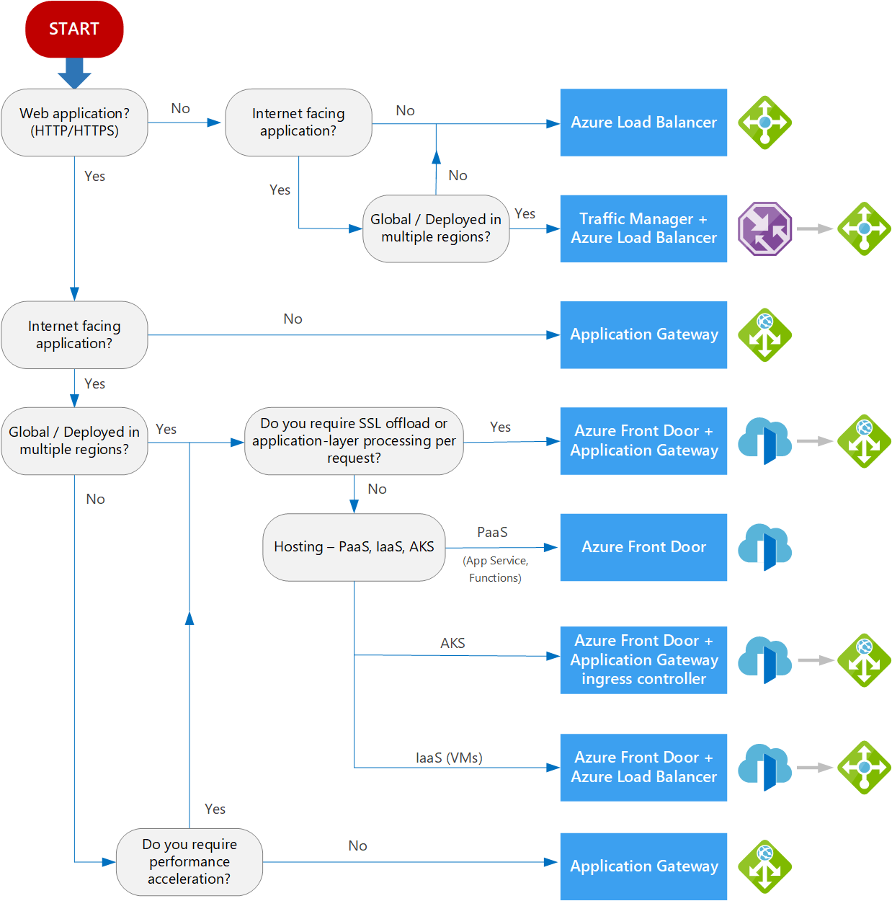

**Azure Load balancing services [[*]](https://learn.microsoft.com/en-us/azure/architecture/guide/technology-choices/load-balancing-overview)**
--------------------------

1.  **Azure Application Gateway**:
    
    *   Layer 7 load balancer for HTTP(S) traffic.
        
    *   [Supports features like SSL offload, web application firewall, and path-based load balancing](https://learn.microsoft.com/en-us/azure/architecture/guide/technology-choices/load-balancing-overview)[1](https://learn.microsoft.com/en-us/azure/architecture/guide/technology-choices/load-balancing-overview).
        
2.  **Azure Front Door**:
    
    *   Global application delivery network with global load balancing.
        
    *   [Accelerates web applications and optimizes user experience](https://learn.microsoft.com/en-us/azure/architecture/guide/technology-choices/load-balancing-overview)[1](https://learn.microsoft.com/en-us/azure/architecture/guide/technology-choices/load-balancing-overview).
        
3.  **Azure Load Balancer**:
    
    *   Layer 4 load balancer for non-HTTP(S) traffic (primarily TCP or UDP).
        
    *   [Distributes traffic within virtual networks across VMs or service endpoints](https://learn.microsoft.com/en-us/azure/architecture/guide/technology-choices/load-balancing-overview)[1](https://learn.microsoft.com/en-us/azure/architecture/guide/technology-choices/load-balancing-overview).
        
4.  **Azure Traffic Manager**:
    
    *   Global DNS-based load balancer for non-HTTP(S) traffic.
        
    *   [Routes traffic to available endpoints based on DNS queries](https://learn.microsoft.com/en-us/azure/architecture/guide/technology-choices/load-balancing-overview)

**Azure Application Proxy**:
    
    *   Azure Application Proxy allows secure remote access to on-premises applications.
        
    *   It acts as a reverse proxy, enabling users to access internal apps from anywhere without a VPN.
        
    *   Traffic flows through Azure AD and then to the on-premises application.
        
    *   [It’s essential to have at least two connectors for high availability](https://learn.microsoft.com/en-us/entra/identity/app-proxy/application-proxy-high-availability-load-balancing)

 