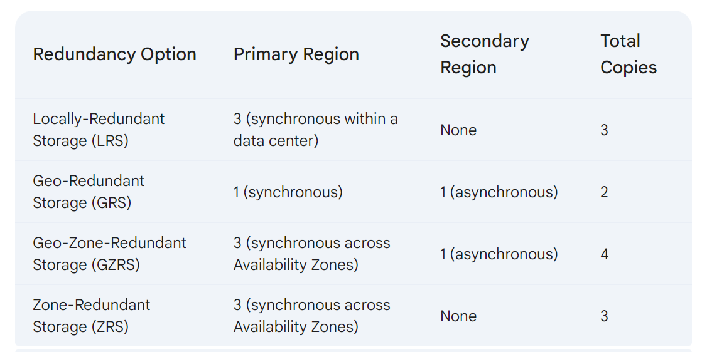

**What is Azure Storage?**
--------------------------

*   Microsoft's cloud storage solution for various data storage needs.
    
*   Offers object storage, file system service, messaging store, and NoSQL store.
    
*   Used for applications, virtual machines, and cloud services.
    

**Types of Data Stored in Azure Storage:**

*   **Virtual Machine Data:** Disks and files (managed disks, data disks) for virtual machines.
    
*   **Unstructured Data:** Non-relational data like website content or application code (Blob Storage, Data Lake Storage).
    
*   **Structured Data:** Data with a defined schema like database tables (Table Storage, Cosmos DB, SQL Database).
    

**Storage Account Tiers:**

*   **General Purpose:** Standard (HDD) for cost-effective bulk storage or infrequently accessed data. Premium (SSD) for low-latency performance for applications like databases.
    

**Key Considerations for Using Azure Storage:**

*   **Durability and Availability:** Data redundancy and replication for disaster recovery.
    
*   **Secure Access:** Encryption and access control mechanisms.
    
*   **Scalability:** Designed to handle massive data storage and performance needs.
    
*   **Manageability:** Microsoft manages infrastructure and maintenance.
    
*   **Data Accessibility:** Accessible globally over HTTP/HTTPS with SDKs and scripting options. Easy management through portal, Storage Explorer, and command-line tools.

**Azure Container**:

*   A container organizes a set of **blobs** (similar to a directory in a file system).
    
*   Each storage account can have an unlimited number of containers.
    
*   Containers store unstructured data, such as media, content, or application data.
    
*   To create a container, follow these steps:
    
    *   In the Azure portal, navigate to your storage account.
        
    *   Go to the **Containers** section and create a new container with a unique name.
        
    *   Set the access level (recommended: **Private**).
        
*   Containers are essential for organizing and managing blob data [0](https://learn.microsoft.com/en-us/azure/storage/blobs/blob-containers-portal)[1](https://learn.microsoft.com/en-us/azure/storage/blobs/blob-containers-portal).
    
**File Shares (Azure Files)**:

*   File shares provide **SMB-based file storage** and **the Network File System (NFS) protocol.** in Azure.
    
*   You can create file shares within a **FileStorage account** (dedicated to Azure file shares only).
    
*   File shares are accessible via standard file protocols (SMB/CIFS) and can be mounted by VMs or on-premises systems.
    
*   Useful for sharing files across VMs or applications.
    
*   No other storage resources (like blobs, queues, or tables) can be deployed in a FileStorage account[0](https://learn.microsoft.com/en-us/azure/storage/blobs/blob-containers-portal)[2](https://learn.microsoft.com/en-us/azure/storage/files/storage-how-to-create-file-share).
    
**Queues**:

*   Azure Queues provide a **messaging store** for reliable communication between application components.
    
*   Ideal for asynchronous communication and decoupling components.
    
*   Use cases include task scheduling, logging, and event-driven processing.
    
*   Queues support **FIFO (first-in, first-out)** message processing.
    
*  [Messages are stored in a queue until processed by a consumer [0](https://learn.microsoft.com/en-us/azure/storage/blobs/blob-containers-portal)[1](https://learn.microsoft.com/en-us/azure/storage/blobs/blob-containers-portal).
    
**Tables**:

*   Azure Tables offer a **NoSQL store** for schemaless storage of structured data.
    
*   Designed for fast querying and scalability.
    
*   Use cases include storing large amounts of semi-structured data (like logs or sensor data).
    
*   Tables support partitioning, indexing, and querying by primary key.
    
*   Not suitable for complex relational data; best for simple key-value pairs [0](https://learn.microsoft.com/en-us/azure/storage/blobs/blob-containers-portal)[1](https://learn.microsoft.com/en-us/azure/storage/blobs/blob-containers-portal).
AzCopy**:
    
*   **Purpose**: AzCopy is a command-line tool for scripted and programmatic data transfer.
    
*   **Functionality**:
    
    *   Allows easy copying of data to and from Azure Blob Storage, Azure File Storage, and Azure Table Storage.
        
    *   Supports concurrency, parallelism, and resuming copy operations.
        
    *   Can also copy data from AWS to Azure.
        
*   **Use Cases**:
    
    *   Bulk data transfer between various Azure storage types.
        
    *   Ideal for moving files quickly.
        
*   **Performance**: Offers optimal performance for data movement [0](https://learn.microsoft.com/en-us/azure/architecture/data-guide/scenarios/data-transfer)[1](https://learn.microsoft.com/en-us/azure/architecture/data-guide/scenarios/data-transfer)[2](https://github.com/Azure/azure-storage-azcopy).
        
**Azure Data Disk**:
    
*   **Purpose**: Azure Data Disk provides block-level storage volumes for Azure virtual machines (VMs).
    
*   **Advantages**:
    
    *   **Highly Durable and Available**: Achieves 99.999% availability with three replicas of data.
        
    *   **Scalable**: Supports up to 50,000 VM disks per subscription per region.
        
    *   **Integration with Availability Sets**: Works seamlessly with availability sets for VM redundancy.
        
*   **Use Cases**:
    
    *   VM storage needs, including IaaS VMs.
        
    *   Ensuring data safety during transient hardware failures.
        
*   **Supported Disk Types**:
    
    *   Standard HDD, Standard SSD, Premium SSD, Ultra SSD, and Performance Plus (preview) [*](https://learn.microsoft.com/en-us/azure/virtual-machines/disks-types)[3](https://learn.microsoft.com/en-us/azure/virtual-machines/disks-types).

**Azure File Sync**:

**Purpose**:

*   Azure File Sync replicates files from your **on-premises Windows Server** to an **Azure file share**.
    
*   It centralizes your file services in Azure while maintaining local access to your data [1](https://azure.microsoft.com/en-us/updates/azure-file-sync/)[1](https://azure.microsoft.com/en-us/updates/azure-file-sync/).
    
**Deployment Options**:

*   **Direct Mount of an Azure File Share**:
    
    *   You can directly mount Azure file shares on-premises or in the cloud using standard SMB clients (available on Windows, macOS, and Linux).
        
    *   No need to manage a separate file server or NAS device.
        
*   **Cache Azure File Share On-Premises with Azure File Sync**:
    
    *   Transforms an on-premises (or cloud) Windows Server into a quick cache of your Azure file share.
        
    *   Provides flexibility, performance, and compatibility of an on-premises file server [2](https://learn.microsoft.com/en-us/azure/storage/file-sync/file-sync-planning)[2](https://learn.microsoft.com/en-us/azure/storage/file-sync/file-sync-planning).
        
**Management Concepts**:

*   **Azure File Share**:
    
    *   Serverless cloud file share in Azure.
        
    *   Accessed directly with SMB or FileREST protocol.
        
    *   Primarily accessed through the Windows Server cache when used with Azure File Sync.
        
*   **Server Endpoint**:
    
    *   Path on the Windows Server being synced to an Azure file share.
        
    *   Can be a specific folder or the root of a volume.
        
*   **Sync Group**:
    
    *   Defines the sync relationship between a cloud endpoint (Azure file share) and a server endpoint.
        
    *   Keeps endpoints within a sync group in sync with each other [3](https://learn.microsoft.com/en-us/azure/storage/file-sync/file-sync-planning)

**Azure Storage redundancy** :
------------------------------

1.  **Locally Redundant Storage (LRS)**:
    
    *   **Replication**: Copies your data synchronously **three times within a single physical location** in the primary region [Refer](https://learn.microsoft.com/en-us/azure/storage/common/storage-redundancy)[1](https://learn.microsoft.com/en-us/azure/storage/common/storage-redundancy).
        
    *   **Durability**: Provides at least **99.999999999% (11 nines)** durability of objects over a given year.
        
    *   **Advantages**: LRS is the **lowest-cost** redundancy option but isn’t recommended for applications requiring high availability or durability.
        
    *   **Use Cases**: Protects your data against server rack and drive failures [Refer](https://learn.microsoft.com/en-us/azure/storage/common/storage-redundancy)[1](https://learn.microsoft.com/en-us/azure/storage/common/storage-redundancy).
        
2.  **Zone-Redundant Storage (ZRS)**:
    
    *   **Replication**: Copies your data synchronously across **three Azure availability zones** in the primary region [Refer](https://learn.microsoft.com/en-us/azure/storage/common/storage-redundancy)[1](https://learn.microsoft.com/en-us/azure/storage/common/storage-redundancy).
        
    *   **Advantages**:
        
        *   Higher availability than LRS.
            
        *   Recommended for applications requiring high availability.
            
    *   **Use Cases**: Ideal for scenarios where data resilience across zones is critical [Refer](https://learn.microsoft.com/en-us/azure/storage/common/storage-redundancy)[1](https://learn.microsoft.com/en-us/azure/storage/common/storage-redundancy)[2](https://learn.microsoft.com/en-us/azure/virtual-machines/disks-redundancy).
        
3.  **Geo-Redundant Storage (GRS)**:
    
    *   **Replication**: Copies your data **synchronously** to a **secondary region** hundreds of miles away from the primary region.
        
    *   **Advantages**:
        
        *   Provides **additional protection** against regional disasters.
            
        *   Ensures data availability even if the primary region fails.
            
    *   **Use Cases**: Critical applications requiring strong disaster recovery capabilities [Refer](https://learn.microsoft.com/en-us/azure/storage/common/storage-redundancy)[1](https://learn.microsoft.com/en-us/azure/storage/common/storage-redundancy).

4.  **Read-Access Geo-Redundant Storage (RA-GRS)**:
    
    *   **Replication**: Similar to GRS, but with **read access** to the secondary region.
        
    *   **Advantages**:
        
        *   Allows read access to replicated data in the secondary region.
            
        *   Useful for scenarios where you need to retrieve data during a primary region outage.
            
    *   **Use Cases**: Applications requiring both disaster recovery and read access to data.
        
5.  **Geo-Zone-Redundant Storage (GZRS)**:
    
    *   **Replication**: Combines ZRS and GRS.
        
    *   **Advantages**:
        
        *   Data is replicated across **availability zones** in the primary region (like ZRS).
            
        *   Additionally, a **read-only copy** is stored in a secondary region (like GRS).
            
    *   **Use Cases**: Balances high availability and disaster recovery needs [Refer](https://learn.microsoft.com/en-us/azure/storage/common/storage-redundancy)

* Table of data copies

**Azure Private Endpoint: A Comprehensive Overview**
------------------------------------------------

Azure Private Endpoint is a secure network interface that enables private connections between your virtual network (VNet) and supported Azure services, such as Azure Storage, SQL Database, and Key Vault. Instead of accessing these services over the public internet, Private Endpoint creates a private and more secure connection, minimizing the risk of attacks and enhancing traffic control.

**Benefits of Azure Private Endpoint:**

*   **Enhanced Security:** Private Endpoint eliminates data exposure to the public internet, reducing the risk of cyberattacks and data leaks.
    
*   **Reduced Latency:** Private Endpoint utilizes the Azure backbone network to connect to services, minimizing latency and improving application performance.
    
*   **Finer Traffic Control:** You can tightly control traffic to Azure services using network security groups (NSGs) and firewall rules within your VNet.
    
*   **Enhanced Compliance:** Private Endpoint can assist in meeting stricter compliance requirements related to data protection.
    

**Implementing Azure Private Endpoint:**

1.  **Create Private Endpoint:** You can create a Private Endpoint in the Azure portal or using Azure CLI or PowerShell.
    
2.  **Configure Private Endpoint:** Specify the VNet, subnet, and Azure service you want to connect to the Private Endpoint.
    
3.  **Update Applications:** Update your applications to use the Private Endpoint's private IP address instead of the Azure service's public IP address.
    

**Application Scenarios:**

*   **Storing Sensitive Data:** Utilize Private Endpoint to connect to Azure Storage for storing sensitive data like medical records or financial information.
    
*   **Accessing SQL Database:** Employ Private Endpoint to connect to Azure SQL Database for running mission-critical business applications.
    
*   **Managing Encryption Keys:** Leverage Private Endpoint to securely connect to Azure Key Vault for managing encryption keys.
    

**Additional Benefits:**

*   **Easy Management:** Manage Private Endpoint alongside other Azure resources within the Azure portal.
    
*   **Scalability:** Private Endpoint can scale to meet your demands as your applications grow.
    
*   **Service Support:** Private Endpoint is supported by a growing number of Azure services.
    

**Overall, Azure Private Endpoint is a powerful tool that can help you enhance security, performance, and control for your Azure applications.**

Here are some additional points to note:

*   Private Endpoint is a zone-agnostic resource. A Private Endpoint's availability is not affected by an availability zone failure within its region.
    
*   Private Endpoint connections are highly available with an SLA of 99.99%.
    
*   Private Endpoint supports both IPv4 and IPv6.
    
*   Private Endpoint is currently not supported for all Azure services. A list of supported services can be found in the Azure documentation.

### Things to know about blob types

*   **Block blobs**. A block blob consists of blocks of data that are assembled to make a blob. Most Blob Storage scenarios use block blobs. Block blobs are ideal for storing text and binary data in the cloud, like files, images, and videos.
    
*   **Append blobs**. An append blob is similar to a block blob because the append blob also consists of blocks of data. The blocks of data in an append blob are optimized for _append_ operations. Append blobs are useful for logging scenarios, where the amount of data can increase as the logging operation continues.
    
*   **Page blobs**. A page blob can be up to 8 TB in size. Page blobs are more efficient for frequent read/write operations. Azure Virtual Machines uses page blobs for operating system disks and data disks.